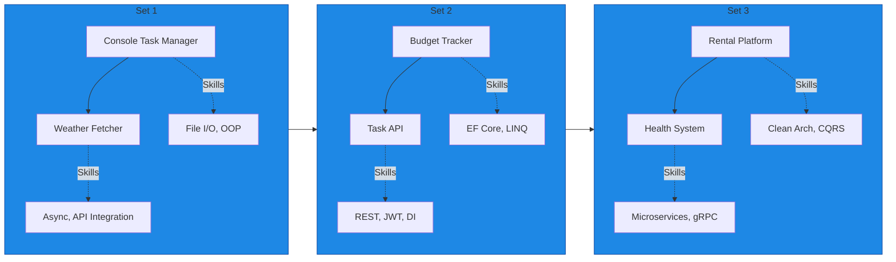
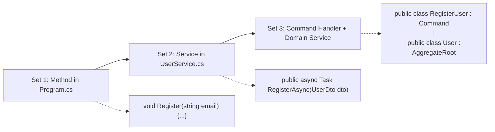
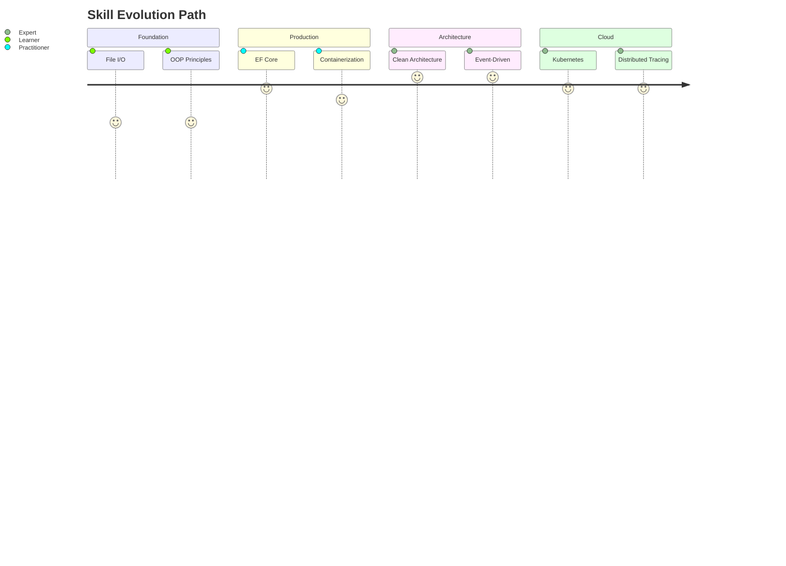

# 🎓 DotNet Projects Hub

Welcome to my journey of mastering Full Stack Development using .NET!

This repository contains progressively complex projects designed to enhance my backend, frontend, DevOps, and system design skills — while integrating AI, real-time data, and cloud features.

---

## 🏅 Progress Badges

| Badge | Skill | Status | Project |
|-------|-------|--------|---------|
| 🟢 `CRUD Hero`         | REST APIs, EF Core, SQL              | ✅ Complete | DevBook |
| 🟡 `Auth Architect`    | JWT Auth, Role-Based Access          | 🔄 In Progress | TaskNest |
| 🟠 `AI Integrator`     | OpenAI, Prompting, PDF Export        | ⏳ Planned | SkillSync |
| 🔴 `Real-time Master`  | SignalR, WebSockets, News Sentiment  | ⏳ Planned | MarketPulse |
| 🧠 `System Designer`   | Clean Arch, SOLID, Patterns          | 🔄 Ongoing | All |
| ☁️ `Cloud Deployer`    | Azure, CI/CD, Docker                 | 🔄 In Progress | All |
| 🔍 `Testing Pro`       | xUnit, Jest, Integration Testing     | ⏳ Planned | TaskNest |
| 💼 `Portfolio Ready`   | Deployment, README, Docs             | 🔄 In Progress | All |

---

## 🚀 Project Roadmap

1. ✅ **DevBook** – Developer Directory (CRUD + Auth Basics)
2. 🔄 **TaskNest** – Productivity Tracker (Roles, JWT, Kanban)
3. ⏳ **SkillSync** – AI-Powered Resume Builder
4. ⏳ **MarketPulse** – Real-Time Stock Dashboard w/ AI

---

## 🎯 Milestone Tracker

| Milestone            | Target Date | Status     |
|----------------------|-------------|------------|
| CRUD & Auth Mastery  | July 2025   | ✅ Achieved |
| First AI Integration | August 2025 | ⏳ Upcoming |
| Cloud CI/CD Setup    | August 2025 | 🔄 Ongoing |
| Final Project (MarketPulse) | Sept 2025 | ⏳ Planned |

---

## 🧠 Learning Goals

- ✅ Master .NET Web API & EF Core
- 🔄 Learn Clean Architecture Patterns
- ⏳ Integrate OpenAI APIs into apps
- ⏳ Build Real-Time Systems with SignalR
- 🔄 Automate Deployment with GitHub Actions + Azure

Here's a **complete Skill & Architecture Progression Map** spanning foundational to advanced levels, aligned with project-based learning:

### 📊 Skill & Architecture Progression Matrix

### 🔧 Technical Skills Progression
| Skill Category          | Set 1                          | Set 2                          | Set 3                              |
|-------------------------|--------------------------------|--------------------------------|------------------------------------|
| **Core Language**       | OOP, Collections               | Advanced LINQ                  | DDD Patterns, Expression Trees    |
| **Concurrency**         | Basic async/await              | Task Parallel Library          | Async Streams, Channel<T>         |
| **Persistence**         | File I/O (JSON/CSV)            | EF Core Migrations             | Polyglot Persistence, Event Sourcing |
| **API Development**     | -                              | REST, Minimal APIs             | gRPC, GraphQL, Protocol Buffers   |
| **Architecture**        | Monolithic                     | Layered, Repository            | Clean Arch, Vertical Slices       |
| **Testing**             | Manual Validation              | xUnit, Moq                     | Contract Tests, Chaos Engineering |
| **Deployment**          | Local EXE                      | Docker                         | Kubernetes, Serverless            |
| **Security**            | Input Sanitization             | JWT Authentication             | OAuth2, Service Mesh, RBAC        |
| **Performance**         | -                              | EF Query Optimization          | Distributed Caching, Sharding     |
| **Observability**       | Console Logging                | Serilog                        | OpenTelemetry, App Insights       |
| **Cloud Integration**   | -                              | -                              | Azure/AWS Services, IaC           |
| **Event Handling**      | Basic Events                   | Delegates                      | Domain Events, Message Brokers    |

### 🏛️ Architecture Progression
| Architecture Aspect     | Set 1              | Set 2                  | Set 3                      |
|-------------------------|--------------------|------------------------|----------------------------|
| **Structural Pattern**  | Single Project     | N-Tier                 | Hexagonal                  |
| **Data Flow**           | Procedural         | Request/Response       | Event-Driven               |
| **Decoupling**          | Tight Coupling     | Interface Segregation  | Bounded Contexts           |
| **Query Handling**      | Direct DB Access   | Repository Pattern     | CQRS with MediatR          |
| **Cross-Cutting**       | Hardcoded Values   | Middleware Pipeline    | Aspect-Oriented Programming|
| **Decomposition**       | Single Module      | Feature Folders        | Microservices             |
| **State Management**    | Transient          | Scoped Services        | Event-Sourced Aggregates  |
| **Integration Style**   | None               | Synchronous HTTP       | Async Messaging (RabbitMQ)|
| **Deployment Unit**     | Executable         | Container              | Helm Chart                |
| **Failure Handling**    | Try/Catch          | Global Error Handler   | Circuit Breakers          |

### 🚀 Cloud & DevOps Progression
| Capability              | Set 1          | Set 2              | Set 3                  |
|-------------------------|----------------|--------------------|------------------------|
| **Environment**         | Local Machine  | Docker Desktop     | Cloud (Azure/AWS)      |
| **Configuration**       | appsettings.json | Environment Variables | Azure Key Vault      |
| **CI/CD**               | Manual Build   | GitHub Actions      | GitOps (ArgoCD)        |
| **Infrastructure**      | -              | Docker Compose      | Terraform/Bicep        |
| **Scaling**             | -              | -                   | KEDA Auto-scaling      |
| **Monitoring**          | Console Output | Basic Logging       | Distributed Tracing    |
| **Storage**             | Local Files    | SQL Server          | Blob Storage + Cosmos DB|
| **Compute**             | Console App    | Web App             | Serverless Functions   |
| **Networking**          | -              | Port Mapping        | Service Mesh (Istio)   |
| **Secret Management**   | Hardcoded      | .env file           | Managed Identity       |

### 📈 Proficiency Milestones
1. **Junior Developer** (After Set 2):
   - Can build CRUD applications
   - Implements basic REST APIs
   - Understands DI and testing

2. **Mid-Level Developer** (Set 3 Project 1):
   - Designs modular systems
   - Implements cloud solutions
   - Optimizes performance bottlenecks

3. **Senior Developer** (Set 3 Project 2):
   - Architects distributed systems
   - Implements SRE practices
   - Makes cloud cost/performance tradeoffs
   - Designs for failure recovery

### 🔄 Progressive Refactoring Example
**Feature: User Registration**

### 💡 Transformation Journey

This progression map provides:
1. Clear skill transition paths from junior to senior level
2. Architecture evolution from monolith to cloud-native
3. Observable growth markers at each stage
4. Interview-ready competency checkpoints
5. Portfolio demonstration strategy

The matrix shows how each project builds specific competencies while gradually introducing architectural complexity, mirroring real-world career progression in .NET development.

---
SkillSync