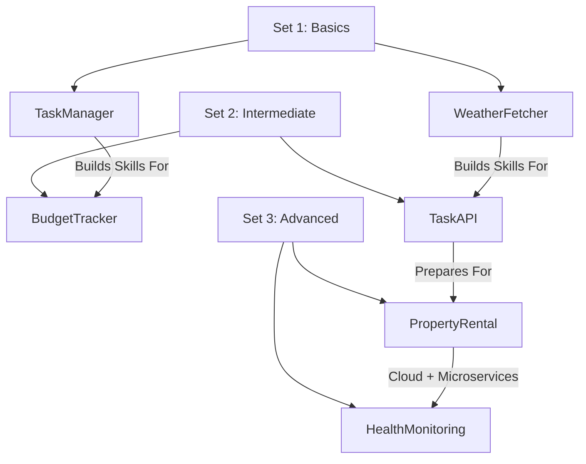

Here’s a **professional and GitHub-ready README.md** for your **dotnet-projects-hub**, including **badges, diagrams, roadmap, setup instructions, and portfolio tips**:

---

# 🚀 **.NET Projects Hub**


A **progressive project-based learning repository** for mastering **C# and .NET** through real-world projects. From **C# basics → Clean Architecture → Cloud Deployment**.

---

## ✅ **Why This Repository?**

Because the best way to learn .NET is by **building real applications**, following a **structured roadmap**:

* **Set 1** → Core C# Fundamentals
* **Set 2** → Production-Ready Design Patterns
* **Set 3** → Advanced Cloud-Native Architecture

---

## 📂 **Repository Structure**

```
dotnet-projects-hub/
├── Set1_Basics/
│   ├── TaskManager/          # Console-based Task Manager
│   └── WeatherFetcher/       # API Integration + Async
├── Set2_Intermediate/
│   ├── BudgetTracker/        # EF Core + LINQ
│   └── TaskManagementAPI/    # REST API + JWT Auth
└── Set3_Advanced/
    ├── PropertyRental/       # Clean Architecture + CQRS + DDD
    └── HealthMonitoring/     # Microservices + Event Sourcing
```

---

## 🛠 **Current Project**

### ✅ **Task Manager Console App**

**Path:** `Set1_Basics/TaskManager`

#### **Features**

✔ Create, list, delete, complete tasks
✔ Filter by **priority**
✔ Sort by **priority** and **due date**
✔ Persist tasks in **CSV file**
✔ Input validation & error handling

#### **Tech Stack**

* **Language:** C#
* **Framework:** .NET Console
* **Concepts:** OOP, Collections, LINQ, File I/O, Exception Handling

---

## ▶ **Quick Start**

```bash
# Clone the repository
git clone https://github.com/your-username/dotnet-projects-hub.git

# Navigate to TaskManager project
cd dotnet-projects-hub/Set1_Basics/TaskManager

# Restore dependencies
dotnet restore

# Run the application
dotnet run
```

---

## 🔑 **Available Commands**

```
list tasks          -> Show all tasks
create task         -> Add a new task
delete task         -> Delete by ID
mark completed      -> Mark task as completed
filterByPriority    -> Filter tasks by priority
sortByPriority      -> Sort tasks by priority
sortByDueDate       -> Sort tasks by due date
addTasksToFile      -> Save tasks to file
exit                -> Quit application
```

---

## 📘 **Learning Roadmap**

### **Set 1: Foundation**

| Project              | Key Skills                     |
| -------------------- | ------------------------------ |
| Console Task Manager | OOP, Collections, File I/O     |
| Weather Fetcher      | HTTP Client, Async/Await, JSON |

### **Set 2: Intermediate**

| Project             | Key Skills                |
| ------------------- | ------------------------- |
| Budget Tracker      | EF Core, LINQ, Migrations |
| Task Management API | REST API, JWT, Docker     |

### **Set 3: Advanced**

| Project                  | Key Skills                                |
| ------------------------ | ----------------------------------------- |
| Property Rental Platform | Clean Architecture, CQRS, DDD             |
| Health Monitoring System | Microservices, Event Sourcing, Kubernetes |

---

## 📊 **Visual Roadmap**



---

## ✅ **Future Enhancements**

* ✅ Add **JSON or DB storage**
* ✅ Implement **unit tests**
* ✅ Build **WPF/Desktop UI**
* ✅ Add **CI/CD pipeline for API projects**
* ✅ Deploy **Set 3 projects to Azure**

---

## 💡 **Portfolio Tips**

* Include **screenshots of console output**
* Add **architecture diagrams** for advanced projects
* Write **Architecture Decision Records (ADRs)**
* Showcase **performance metrics** (e.g., Redis caching improvements)
* Add **GitHub Actions badge** for CI/CD builds

---

## 🔐 **License**

[MIT License](LICENSE)

---

🔥 Do you want me to **also create a `README.md` template for each individual project** (with sections like *Overview, Features, Setup, How It Works, Screenshots*) so that each project has its own professional documentation?
Or should I **give you the final copy-paste-ready README for TaskManager now**?
